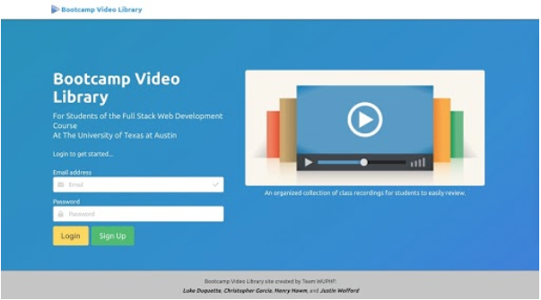

# BOOTCAMP VIDEO LIBRARY 
### Project 2 - Group 6 (TEAM WUPHF)
___Justin Wofford, Luke Duquette, Christopher Garcia, Henry Hawm___

## Screenshot




## Summary

This application will allow for the creation of a video library to house the class recordings for the web developer bootcamp.  The admin (creator) will submit video links, video titles, and a few keywords of the key concepts that were discussed in that day’s recording.  The non-admin user (student) will access the videos and will have the ability to post comments on the individual recording pages with questions, comments or helpful links on the subject matter.  For an API, we are considering displaying Udemy courses or even just Google search results based on the keywords that are specific to each video.


## User Stories

```diff
+ AS A Bootcamp Web Developer Course student
+
+ I WANT an easy way to access the class recordings, find supplemental information on each topic, and communicate with other students based on the topic
+
+ SO THAT I can have the resources I need to learn successfully
```

```diff
+ AS A Bootcamp Web Developer Course Instructor
+ 
+ I WANT an easy way to organize my daily class recordings

+ SO THAT I can provide my students with a easy way to access them
```


## New Technology

- [JQuery Comments Library](https://viima.github.io/jquery-comments/)
- [Google YouTube API](https://developers.google.com/youtube/v3)


## Tech List

- HTML 5
- Bulma CSS Framework
- JavaScript
- Node.JS
- Express.JS
- Axios
- Dotenv
- ESLint
- MySQL
- Sequelize
- Heroku
- JawsDB
- YouTube API
- jQuery Comments Library

## Breakdown of Tasks

- Project planning
- Build HTML layout
    - Admin to submit video links, titles, recording date, and keyword
    - User to show video library, & individual video pages with comment displays/forms
- Build schema for SQL and create seed file
- Setup Controller routes for db GETS/POSTS
- Setup routes for handling endpoints
- Setup jQuery Comments
- Connect YouTube API
- Deploy to Github and Heroku


## Future Developments

- Lock down video submission to Admin user role only
- Implement video submission input validation
- Change the jQuery Comments library to use the MySQL database instead of the JS file for storing data
- Add functionality for the jQuery comments to be video specific
- Jump to video time based on user comment timestamp
- Add Udemy Affiliate API to show related courses


